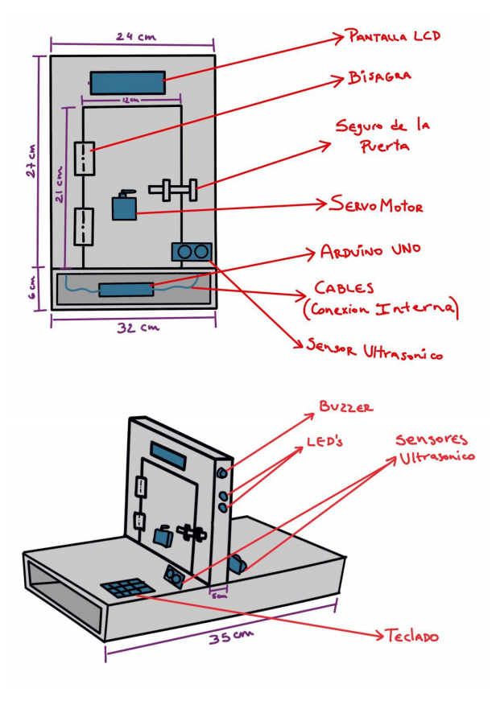
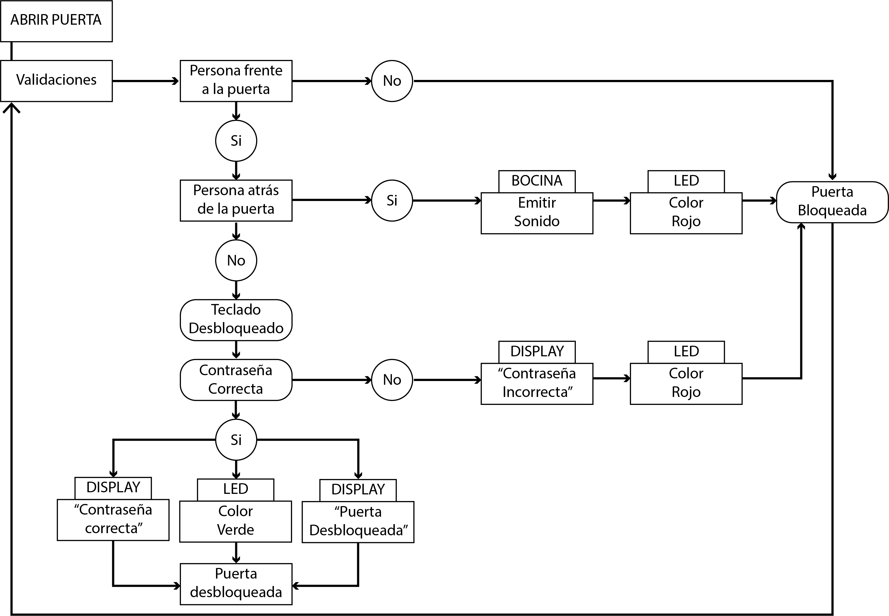
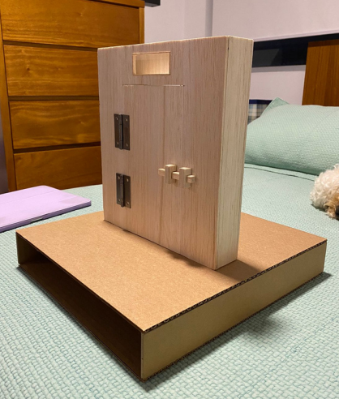
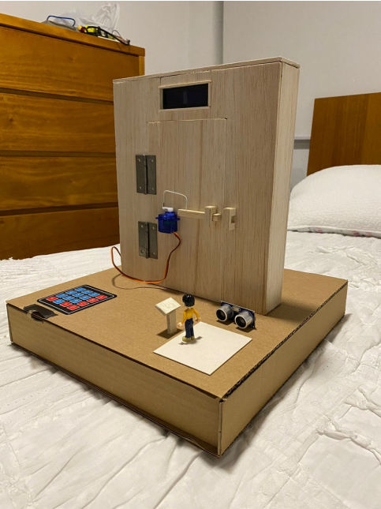
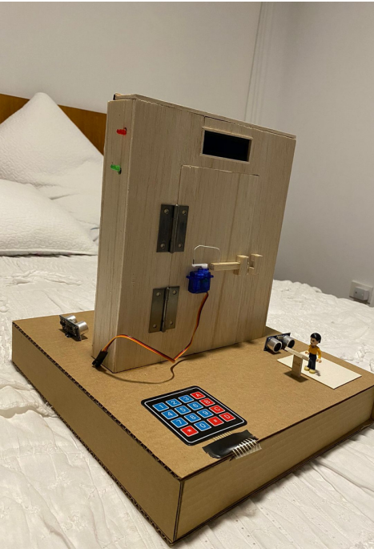
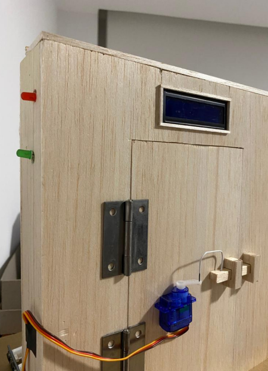
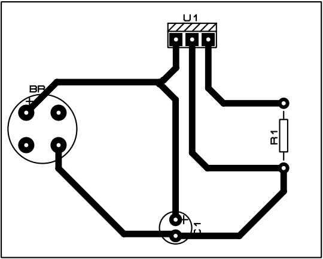
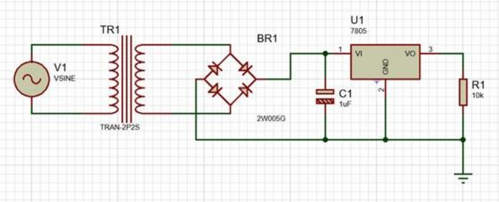

# Advanced Security System

## Description
The Maximum Security Door System is an advanced electronic project designed to enhance the security of prison facilities by incorporating multiple sensors and a servo-controlled locking mechanism.

The system utilizes an Arduino Uno to manage various components, including proximity sensors, a keypad, an LCD display, a servo motor, and others.

The door can only be unlocked when specific conditions are met: no objects should be too close on the opposite side, a person must be physically present at the keypad, and a digital password must be entered.

An alarm and LED lights are triggered if these conditions are not satisfied, providing an additional layer of security.

This project demonstrates understanding of electronics, programming, and real-world application to address critical security challenges.

**Note:** This project is in Spanish because it was completed at Universidad San Francisco de Quito, Ecuador.

## Project Images

### Design and Schematics

### Block Diagram

### Door Model

### Door with Components Installed

### PCB Design

### Power Supply Design

## Additional Documentation
For more detailed explanations of each part of the project, please refer to the attached documents in this GitHub repository. The code used for the project is also available for review.

